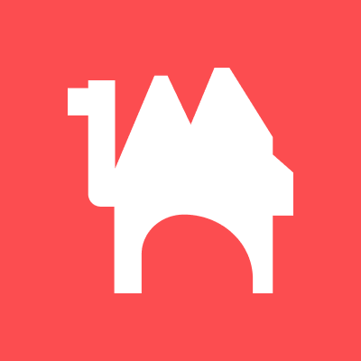
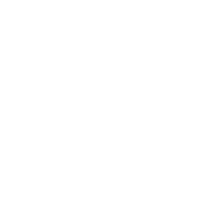

  

  

   

  <h3>VRChat Developer &amp; Community Builder</h3>

  

    I'm a self-taught developer and community organizer working primarily around VRChat. I build tools, run communities, and help good projects become easier to use.
  

  

    &nbsp;&nbsp;
    &nbsp;&nbsp;
    &nbsp;&nbsp;
    &nbsp;&nbsp;
    &nbsp;&nbsp;
    &nbsp;&nbsp;
    &nbsp;&nbsp;
    
  

